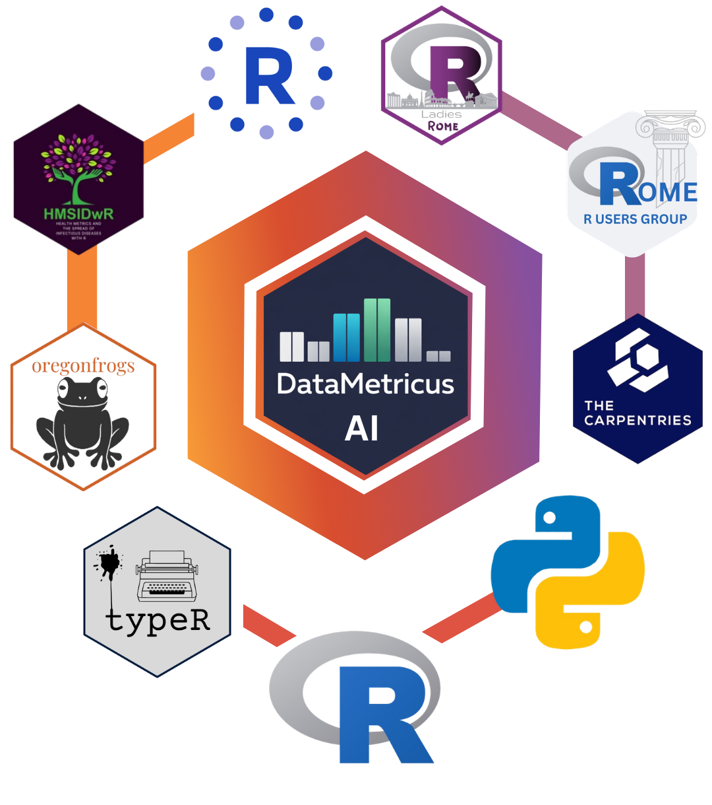

::: {.page-full}

```{=html}
<div class="scrolling-banner">
  <p class="multipleStrings"></p>
</div>

<script src="https://cdn.jsdelivr.net/npm/typeit@7.0.4/dist/typeit.min.js"></script>

<script>
  new TypeIt(".multipleStrings", {
      strings: [
      "Welcome to my Website",
      "AI-augmented analytics for health, risk, and decision-making",
      "Health Metrics and the Spread of Infectious Diseases",
      "New book in progress: Mortality 🔍 Analytics - more info coming soon 🔥"
      ],
      breakLines: false,
      loop: true,
      speed: 45
  }).go();
</script>

<section class="landing-hero" aria-labelledby="landing-title">
  <div class="landing-hero__content">
    <p class="landing-kicker">AI-first analytics · health metrics · R workflows</p>
    <h1 id="landing-title">AI-Augmented Analytics for Health, Risk, and Decision-Making</h1>
    <p class="landing-lede">
      I design analytical workflows that combine AI, statistics, R, and health metrics to turn complex data into practical decisions.
    </p>
    <div class="landing-actions" aria-label="Primary homepage actions">
      <a href="content/proj/posts/automation_workflow/" class="landing-button landing-button--primary">Explore AI Workflows</a>
      <a href="content/books/posts/hmsid/" class="landing-button">Read the Book</a>
      <a href="about/workshops/" class="landing-button">Workshops &amp; Talks</a>
    </div>
  </div>

  <div class="landing-hero__visual" aria-label="Federica Gazzelloni analytics platform">
    
    <div class="landing-proof">
      <span>Author</span>
      <span>Health Metrics Research</span>
      <span>R Educator</span>
      <span>AI Workflow Builder</span>
    </div>
  </div>
</section>

<section class="landing-pathways" aria-label="Main website pathways">
  <a href="content/proj/posts/automation_workflow/" class="landing-pathway">
    <span>AI Workflows</span>
    <strong>Build repeatable systems for research, monitoring, and decision support.</strong>
  </a>
  <a href="content/books/posts/hmsid/" class="landing-pathway">
    <span>Health Metrics</span>
    <strong>Explore infectious disease analytics, burden of disease, and spatial modelling.</strong>
  </a>
  <a href="content/blog/posts/stats/" class="landing-pathway">
    <span>R &amp; Statistical Modelling</span>
    <strong>Learn practical R workflows for models, visualization, and reproducible analysis.</strong>
  </a>
</section>
```

:::

## News: Health Metrics and the Spread of Infectious Diseases — Now Published and Available Worldwide

> Gazzelloni, Federica. Health Metrics and the Spread of Infectious Diseases: Machine Learning Applications and Spatial Modelling Analysis with R. First edition. Boca Raton, FL: CRC Press, 2025. Print.

### 🎉 Explore the Online and Printed Versions

📖 Read it online for free:

-   🔗 [https://fgazzelloni.github.io/hmsidR/](https://fgazzelloni.github.io/hmsidR/)

🛒 Order your Hard Printed Copy:

-   Order the printed edition:👉 [Routledge Website](https://www.routledge.com/Health-Metrics-and-the-Spread-of-Infectious-Diseases-Machine-Learning-Applications-and--Spatial-Modelling-Analysis-with-R/Gazzelloni/p/book/9781032625782) or 👉 [Amazon](https://amzn.to/4aHGseT)

:::{.callout}
> It’s been an incredible journey, and now that the book is officially printed and available on Amazon to order, I feel a mix of emotions—both the excitement of sharing it with you and a touch of nostalgia as this creative process comes to a close. 😌

Writing this book has been an immensely rewarding experience. I’ve spent countless hours selecting the right material and striving to present it in a way that’s accessible and helpful for early-career researchers and students. One of the biggest challenges was deciding what to include and what to leave out, constantly refining the content to ensure it’s both comprehensive and easy to follow.

Even though the book is now published, my mind is still buzzing with ideas. There’s always that lingering thought of what else could be added to make it even better. But at some point, you have to step back and trust that what you’ve created will serve its purpose. And now, it’s time to see how it will resonate with you, the readers.

> As I reflect on this journey, I’m filled with gratitude for all the support and feedback I’ve received along the way. Your encouragement has been invaluable in shaping this book into what it is today.

So, what’s next? While this project may be wrapping up, my passion for writing and sharing knowledge is far from over. Stay tuned for more updates and future projects! In the meantime, I invite you to dive into the book, explore its content, and share your thoughts. Your insights will be crucial as I continue to learn and grow.

Thank you for being a part of this journey. I hope the book serves as a valuable resource for your research and studies. Let’s see where this new chapter takes us!

**Happy reading! 📚✨**
:::


```{=html}
<div class="hero-content">
  <center><a href="https://www.youtube.com/@federicagazzelloni" class="cta-button">SUBSCRIBE</a>
    <p class="hero-subtitle" style="font-size: 1.5rem;">Subscribe for the latest tutorials and insights in Data Science and R Programming!</p>
    <video width="60%" height="auto" autoplay loop muted playsinline>
    <source src="images/welcome-video.mp4" type="video/mp4">
    </video>
     </center>
</div>
```


:::: column-page
::: {style="margin-top: 10px; font-size: 3em;  font-weight: bold; text-align: center; background-color: #343a40; color: white;"}
Latest content
:::
::::


<link rel="me" href="https://fosstodon.org/@fgazzelloni">
